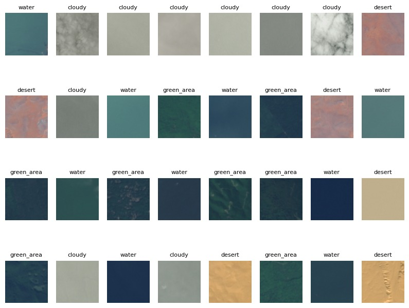
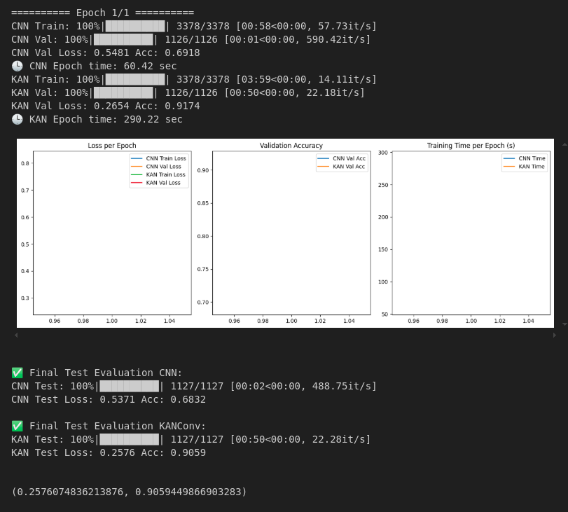
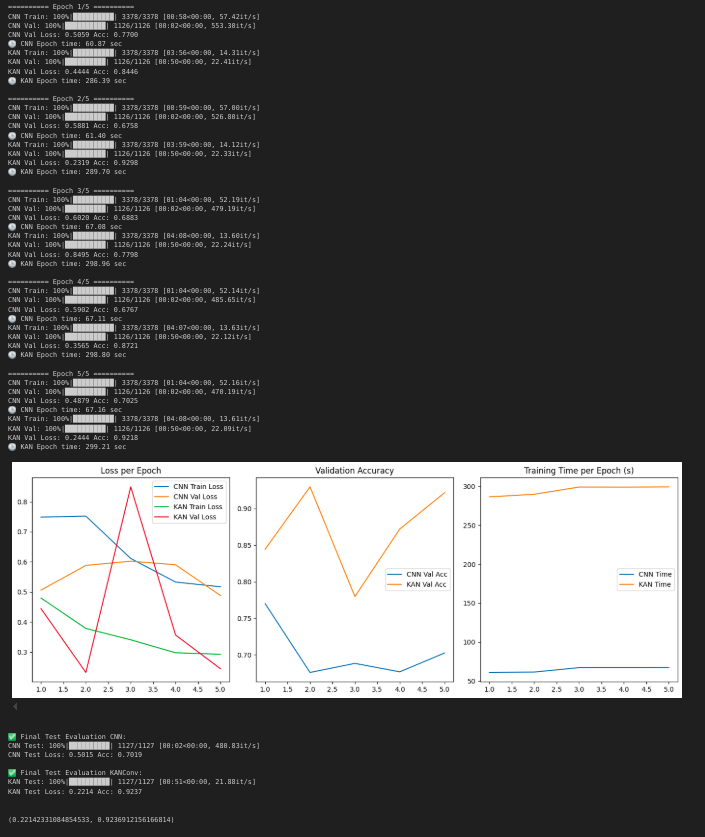

# CNN vs CKAN Satellite Images Classification
This project implements and compares two neural network architectures for image classification:

A traditional Convolutional Neural Network (CNN).

A Kolmogorov–Arnold Network (KAN)-based Convolutional Network.

The goal is to evaluate and compare:

-  Classification accuracy

- Training and validation loss across epochs

- Training time per epoch

## Dataset 

[Satellite Image Classification
 from Kaggle](https://www.kaggle.com/datasets/mahmoudreda55/satellite-image-classification) 

 

 ## Results

During training, the following were observed:

- CNN trains faster and uses less GPU memory.

- KANConv offers flexible function approximation but consumes significantly more memory and is slower to train.

### 1 Epoch Training Results

### 5 Epoch Training Results

## Credits 

This project uses the KAN Convolutional Layer implementation from:

- [Convolutional-KANs](https://github.com/AntonioTepsich/Convolutional-KANs?tab=readme-ov-file)

- [CONVOLUTIONAL KOLMOGOROV-ARNOLD NETWORKS](https://arxiv.org/pdf/2406.13155)

Copyright (c) 2024 Alexander Bodner, Antonio Tepsich, Jack Spolski and Santiago Pourteau
Licensed under the MIT License.
The original KAN Convolutional Layer code is used in accordance with the MIT license.
 All rights for the KAN algorithm and implementation belong to the respective authors.